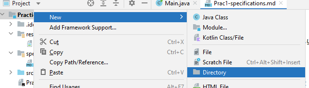
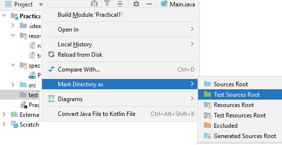

## Practical 1

### Getting Started

**_It is important that you fully read the instructions before you begin to code!_**

### Task 1

Add the following to the current project.

```java
public class Practical1 {
    public static int max3(int num1, int num2, int num3) {
        return -1;
    }
}
```

It contains a **method stub** called <samp>max3</samp> which is **supposed** to return the largest of its three integer
parameters. For example,

```java
    int st=Practical1.max3(9,3,4);
        System.out.println(st);
// outputs "9" (without the quotes)
```

_**Do not change the implementation of the max3 method just yet.**_

Create the appropriate JUnit tests for the method.

**Hint:** If you don't have a test root directory for your project you will need to create one.

- create a directory at the same level as **src**. Right-click the project name and select **New | Directory**<br>   
   <br><br>
- Once created right-click the directory and select **Mark Directory As | Test Sources Root** <br>  
   <br>  
  The tests folder should be marked with the  icon

#### Adding a new test

1. In your production code in the editor, place the caret at the class for which you want to create a test, press
   <kbd>Alt+Enter</kbd>, and select **Create Test**.
2. In the _Create Test_ dialog, select the library that you want to use (**_JUnit 5_**).   
   If you don't have the necessary library yet, you will be prompted to download it. To do that, click **Fix**.
3. Configure the test class name and its location and select the methods that you want to test. Click **OK**.  
   As a result, IntelliJ IDEA creates a new test class with the specified name and generated test methods in the **Test
   Sources Root**.

Further information is available at: [Create Tests](https://www.jetbrains.com/help/idea/2021.3/create-tests.html)

Note that JUnit tests generally do not print out the result of calling a method. They typically store the value in a
variable and compare it with an expected result using one of the <samp>assert??</samp> methods from the
<samp>org.junit.jupiter.api.Assertions.*</samp> classes.  
The test code generated by IntelliJ IDEA (which you will need to add additional tests to) has this structure.

Add more <samp>@Test</samp> annotations to **_comprehensively_** test the **expected** output of <samp>max3</samp>

**Do not change the implementation of the <samp>max3</samp> method just yet**

To run your tests, see: [Run Tests](https://www.jetbrains.com/help/idea/2021.3/performing-tests.html)

---
**Show your code to a demonstrator and be prepared to explain why it is correct and why your tests are appropriate and
comprehensive.   
<mark>At this point your method stub should _fail_ most the tests**.</mark>

---

#### Task 2

Now for some Test Driven Development (TDD). Here is a starting point for your <samp>max3</samp> method.

```java
public class Practical1 {
    public static int max3(int num1, int num2, int num3) {
        int max = Math.max(num1, num2);
        return Math.max(num2, num3);
    }
}
```

Check to see if the newly developed method passes all the test you created in the previous checkpoint.

_There is an error in the above code, and you should include a test to test for this error_.

Now change the implementation of the <samp>max3</samp> to **PASS** all the tests. A working solution should pass all the
tests.

---
**Show your code to a demonstrator and be prepared to explain why it is correct and why your tests are appropriate and
comprehensive.  
Explain to the demonstrator which test method identifies the error above.**

---

### Task 3

Add a static method called <samp>concat</samp> to the class <samp>Practical1</samp> that takes an
`ArrayList<String>` as a parameter and returns a string containing all the strings in the <samp>ArrayList</samp>
concatenated together. For example,

```java
    ArrayList<String> test = new ArrayList<String>();
        test.add("one");
        test.add("two");
        test.add("three");
        String st = Practical1.concat(test);
        System.out.println(st);
// outputs "onetwothree" (without the quotes)
```

Create appropriate JUnit tests for the method (as above). For example, what happens when a `null` is added? What if the
list is empty?

If a `null` <samp>ArrayList</samp> is passed to the <samp>concat</samp> method it should throw a
```java.lang.IllegalArgumentException``` Ensure you create a test to test for this occurrence using the **annotation
notation** for expected exceptions.

**Hint**: Press <kbd>Alt + Insert</kbd> and select **Test...**. Then select your newly created method and press **Ok**  
IntelliJ IDEA will add test code for the new method to your existing test class.

Add a static method called <samp>sumSL</samp> to the class <samp>Practical1</samp> that takes an `ArrayList<Integer>`
as a parameter and returns the sum of the smallest and largest elements in the array list **by making use of the
methods**
`Collections.max` **and** `Collections.min`

For example,

```java
    ArrayList<Integer> test = new ArrayList<Integer>();
        test.add(9);
        test.add(2);
        test.add(4);
        test.add(10);
        int i = Practical1.sumSL(test);
        System.out.println(i);
// outputs "12" (without the quotes)
```

Create appropriate JUnit tests for the method.

---
**Show your code to a demonstrator and be prepared to explain why it is correct and why your tests are appropriate and
comprehensive.**

---

### Task 4

In the <samp>Practical1</samp> project, define a class, called `Student`, to represent students. Each student has an
<samp>idNumber</samp> (that is unique to them), a <samp>familyName</samp>, a <samp>personalName</samp> and a
<samp>yearOfBirth</samp>. Make use of the IntelliJ IDEA facility to generate _getters_ and _setters_.  
Note that the <samp>idNumber</samp> should only have a _getter_ while all other instance variables should have
_getters_ and _setters_. Also use the IntelliJ IDEA facility to generate a _constructor_:

A student can then be created with:

```java
Student student1 = new Student(1,"Bloggs","Fred",1980); 
```

Create appropriate JUnit tests for the all the methods in the <samp>Student</samp> class. **Do include tests for the
getter and setter methods**.  
For example, create the test case for the unit test of <samp>Student</samp>

```java
 /**
 * Test of getFamilyName method, of class Student.
 */
@Test
public void testGetFamilyName(){
        System.out.println("getFamilyName");
        Student instance = new Student(1,"Bloggs","Fred",1980);
        String expResult = "Bloggs";
        String result = instance.getFamilyName();
        assertEquals(expResult,result);
        }
```

### Task 5

Add a method called <samp>getAge</samp> to the <samp>Student</samp> class that calculates and returns the age of a
student. For example,

```java
Student stud1 = new Student(1,"Bloggs","Fred",1979);
        int i = stud1.getAge();
        System.out.println(i);
// outputs "35" (without the quotes)
```

Create appropriate JUnit tests for the new method.  
Note, you should not assume the year is 2022! Your code may be run next year, or the year after that, and it should
return the correct age at any time in the future (or the past).  
**Hint**: you can determine the current year with:
```java
int currentYear = Calendar.getInstance().get(Calendar.YEAR);
```


